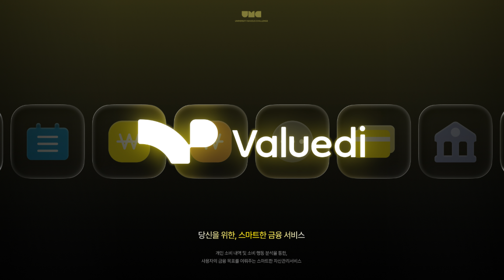
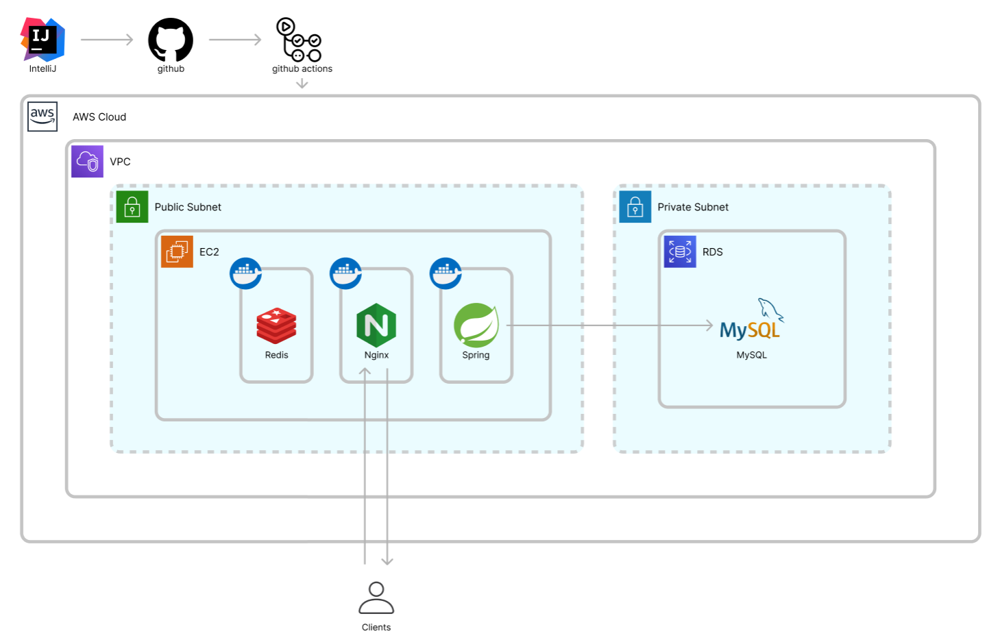
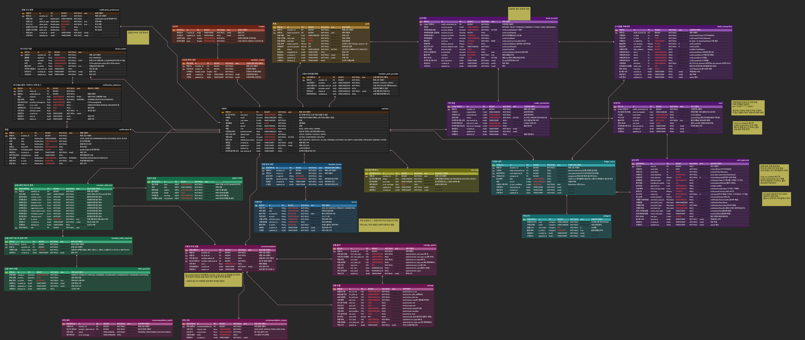

# 🔥 VALUEDI - 목표 달성을 돕는 자산 관리 서비스



**목적: 밸류디(VALUEDI) 서비스 개발**

VALUEDI는 사용자의 금융 데이터를 기반으로 **목표 중심 자산 현황을 제공**하고, **소비 성향을 분석**하여  
개인에게 적합한 금융 상품을 추천함으로써 **목표 달성을 돕는 자산 관리 서비스**입니다.

---

## 📌 프로젝트 개요
- **목표 중심 자산 현황 제공**: 사용자의 자산/목표 정보를 기반으로 현재 진행 상황을 시각화/요약
- **소비 성향 분석**: 거래/소비 데이터를 바탕으로 소비 패턴을 분석
- **금융 상품 추천**: 사용자 성향 및 목표에 맞는 금융 상품(예: 적금)을 추천

---

## 🏗️ 서버 아키텍처 다이어그램



### 구성 요약
- Client(Web/App) → **Nginx(Reverse Proxy)** → **Spring Boot API Server**
- Spring Boot API ↔ **Redis** (캐시/세션/임시 데이터 등)
- Spring Boot API ↔ **RDS(MySQL)** *(Private Subnet)*
- IntelliJ → GitHub → **GitHub Actions(CI/CD)** → AWS(EC2) 배포

---

## 🗃️ ERD



---

## 🧩 사용한 브랜치 전략 / 기술 스택 / 프로젝트 구조

### 브랜치 전략
이슈 단위로 작업을 관리하며, **브랜치명에 이슈 번호를 포함**합니다.
- 형식: `<type>/#<issue-number>-<short-description>`

**type 예시**
- `main` : 배포/최종 제출 브랜치
- `develop` : 개발 통합 브랜치
- `feat/*` : 기능 개발
- `fix/*` : 버그 수정
- `hotfix/*` : 운영 중 긴급 버그 수정
- `ref/*` : 리팩토링
- `docs/*` : 문서(README 등)

**브랜치 예시**
- `feat/#58-savings-recommendation`
- `fix/#79-goal-after-balance`
- `ref/#84-trophy-current-member`

---

### 기술 스택
#### Backend
- Core: Java 17, Spring Boot 4.0.1, Gradle
- Data: Spring Data JPA, QueryDSL 7.0, MySQL (RDS), Redis
- Security: Spring Security, JWT
- Network & Integration: OpenFeign, Spring Retry, WebClient

#### Infra & DevOps
- Cloud: AWS (EC2, Route 53, VPC)
- Server: Nginx (Reverse Proxy, HTTPS/SSL)
- Database: MySQL (RDS), Redis
- CI/CD: Docker, GitHub Actions

#### CI/CD
- GitHub Actions

#### External APIs
- AI: Google Gemini
- Finance: CODEF (마이데이터), FSS (금감원 OpenAPI)

#### Collaboration / Tools
- Documentation: Swagger (SpringDoc OpenAPI 3.0)
- Management: GitHub, Notion

---

### 프로젝트 구조 (DDD 기반)
- 본 프로젝트는 DDD(Domain-Driven Design) 관점에서 **도메인별로 비즈니스 로직을 분리**하여 관리합니다.
- `domain/*`에는 각 도메인의 Entity/Service/Repository 등 핵심 로직을 배치합니다.
- `global/*`에는 공통 설정, 보안, 응답 포맷, 외부 API 연동 모듈을 관리합니다.

```
src/main/java/org/umc/valuedi
├── domain
│ ├── asset
│ │ ├─ controller
│ │ ├─ converter
│ │ ├─ dto
│ │ ├─ entity
│ │ ├─ enums
│ │ ├─ exception
│ │ ├─ repository
│ │ └─ service
│ ├── auth
│ ├── connection
│ ├── goal
│ ├── ledger
│ ├── mbti
│ ├── member
│ ├── savings
│ ├── terms
│ └── trophy
└── global
├── apiPayload
│ ├─ code
│ ├─ exception
│ └─ handler
├── config
├── external
│ ├─ codef
│ ├─ fss
│ └─ genai
└── security
  ├─ annotation
  ├─ handler
  ├─ jwt
  ├─ principal
  ├─ service
  └─ util
```

---

## 👥 팀원 정보
| 이름  | 역할 | 깃헙 주소                          |
|-----|------|--------------------------------|
| 권도희 | Backend | https://github.com/seamooll    |
| 최정규 | Backend | https://github.com/JeongGyul   |
| 윤도훈 | Backend | https://github.com/hodoon      |
| 이가은 | Backend | https://github.com/kkeunii     |
| 이시연 | Backend | https://github.com/lee-si-yeon |
